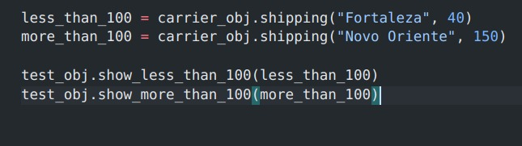

# 🎯 Challenge for Python Programmer

## 📋 Sumary

- [📋 Sumary](#-sumary)

- [📖 About](#-about)

- [🎯 Solution](#-solution)

- [🛠 Technologies used](#-technologies-used)

- [⚙ How to run the project](#-how-to-run-the-project)


## 📖 About

This project consists of a simple challeng for python developer. The main objective was to use python to, from a csv file on carrier data, search for which carrier makes the cheapest delivery to a specific city and which makes the fastest delivery. It was also requested to show all shipping information, such as: name of the carrier, weight of the product, value of freight, city and time for delivery.

## 🎯 Solution

To solve the problem, only one Class (Carriers) was created with 3 methods, which are: shipping, localize, string_to_numeric.

- The csv is read through the pandas library.

- The string_to_numeric method receives a list of strings and returns another list containing only the numerical part of each string, eg: ['R $ 3.10', 'R $ 6.40'] = ['3.10', '6.40']

- The localize method receives a dataframe and a key. Calculates the minimum value for a column of this dataframe according to the key. The string_to_numeric method is used to ensure that the operation is done only with numeric data. After taking the minimum value for the key of interest, the dataframe line is returned where the minimum value is located.

- The shipping method receives the city and the weight of the product. From this, all lines of the main dataframe (csv file) where this city is located are selected, thus generating a new dataframe with only data referring to that city. If you have data about the city, the dataframe is passed to the localize method that will return the data according to what is required in the problem (cheaper shipping and faster shipping) considering the weight of the product. If no city data is found, no processing is performed and the city is returned to the user, informing that there is no shipping data for the city.


## 🛠 Technologies used

For the development of this simple project, the following technologies were used:

- python 3.6
- Pandas

## ⚙ How to run the project

To reproduce this project follow the steps below:

- Clone this repository:

  ```sh
  git clone https://github.com/lucasousa/desafio-python
  ```

- Enter the desafio-python folder:

  ```sh
  cd desafio-python
  ```

- Create and active the virtual environment (virtualenv):

  ``` sh
   python3.6 -m venv env #I do it that way, but you can do it as you see fit. You can also use a python version greater than 3.6
  ```
  ``` sh
   source en/bin/activate #I do it that way
  ```

- Install the requirements:

  ```sh
    pip install -r requirements.txt
  ```

- Now run the test file (tests.py):

  ```sh
    python tests.py
  ```
- In the test file, the main class is imported, which solves the problem. In it is also the Test class with two methods that show the data formatted according to what is required in the problem.
You can customize the Tests by changing the methods call as below:



